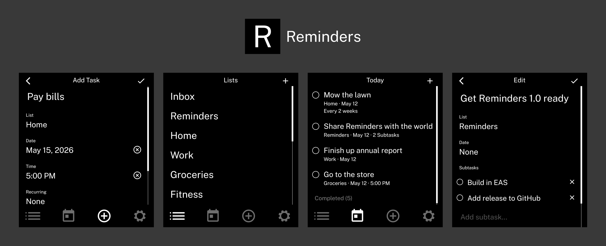

# Reminders

A reminders app for the Light Phone III.

Organize tasks into lists, add due dates and times, check things off as you go, and get notified when it matters.

Built with [vandamd's light-template](https://github.com/vandamd/light-template) — a community-made Expo template for building LightOS-style apps for the Light Phone III.


---

## Features

* Organize tasks into multiple lists
* Add due dates and times to any task
* Today view shows only tasks due today
* Subtasks on any task, including when adding a new task
* Check off tasks and subtasks with a tap
* Completed tasks move to a collapsible group at the bottom
* Long-press a list to rename, reorder, clear completed, or delete it
* Notifications for tasks with a set time
* Daily bundled notification for today's untimed tasks
* Custom LightOS-style date and time pickers
* Respects LightOS theme (black/white mode)

---

## Installing on Light Phone III

* Highly recommend using [Obtainium](https://github.com/ImranR98/Obtainium) to ensure you receive future updates and new features automatically. Just add [the repo URL](https://github.com/zacksimpson/reminders-tool/), make sure you're able to install apps from unknown sources, and you're all set.
* Alternatively, you can download the latest APK from the Releases tab.

---

## Building

This project uses [Expo](https://expo.dev) and [EAS Build](https://docs.expo.dev/build/introduction/).

### Prerequisites

* [Bun](https://bun.sh)
* [EAS CLI](https://docs.expo.dev/build/setup/)
* An Expo account

### Steps

```
bun install
eas login
eas build --platform android --profile preview
```

EAS will build the APK in the cloud and provide a download link.

---

## SupportIf any of my tools have been useful to you, I'd love to hear from you! Feel free to reach out [here](mailto:zacksimpson24@gmail.com). Another way to support is to [consider sponsoring](https:## Credits## Creditsgithub.com## Creditssponsors## Creditszacksimpson). Either way, it means a lot!## Creditsn## Creditsn---## Creditsn## Creditsn## Credits

* [vandamd](https://github.com/vandamd) — [light-template](https://github.com/vandamd/light-template), the community Expo template this app is built on
* [iamkory](https://www.reddit.com/user/iamkory/) — [LighterOS Figma design toolkit](https://www.figma.com/design/1k2PkAjOSet8f9jjVdhM2L/LighterOS?node-id=65-2018&t=3Qd2sXdySZCzTVtK-1) excellent reference for recreating the LightOS aesthetic
* [The Light Phone](https://www.thelightphone.com) — for building a phone worth making apps for
